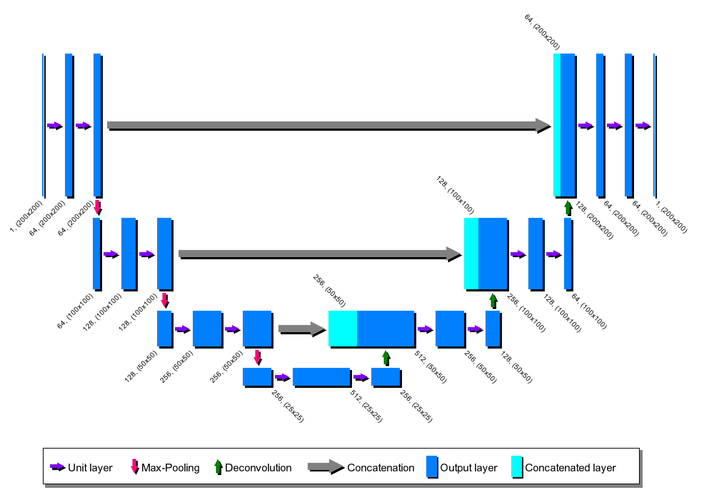

# CNN diagram

Simple and customizable [Processing](https://py.processing.org/) script in python to generate a diagram for a neural network architecture. Specially suited for CNNs.

Sample UNet diagram, employed in [arXiv:2006.14305](https://arxiv.org/abs/2006.14305).
